# Employment
 Assignment Title: quan ly nhan vien
## Assignment Description:

In this assignment, you will create a basic Java

## Instructions:

1. Fork the provided project repository to your profile and copy it to your machine to start the project.
2. Design and implement an “employee management” mobile application that allows users to Add, Delete, and Edit a Job.
3. The application must have the following pages:
   - Home Page: Displays the login registration home page
   - Main page: Displays the employee application

## Requirements:

-  Use java to create the web application.
-  Use  pool query  for fetching and caching the  data.
-  Write clean, maintainable, and well- documented code.
-  Use Git for version control, committing your code regularly to the forked Git repository in your profile.

### Technology used

- Java.
- Database: SQL Lite

### Function Description:
- Login function
- Registration and login use cookies to save previous logins
-Login page
- Main page: Add, Delete, Edit employees.
-Change language from English to Vietnamese and vice versa

## Screenshots

### Landing Page

### Login 

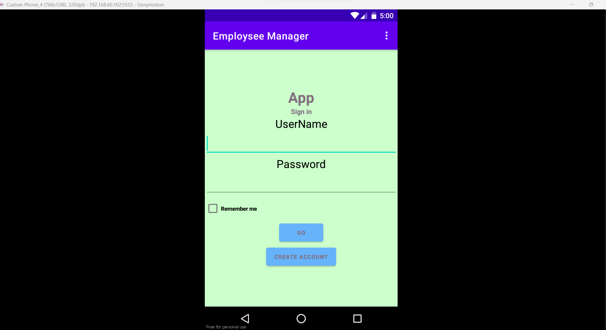

on click login it shows main page
### Main page
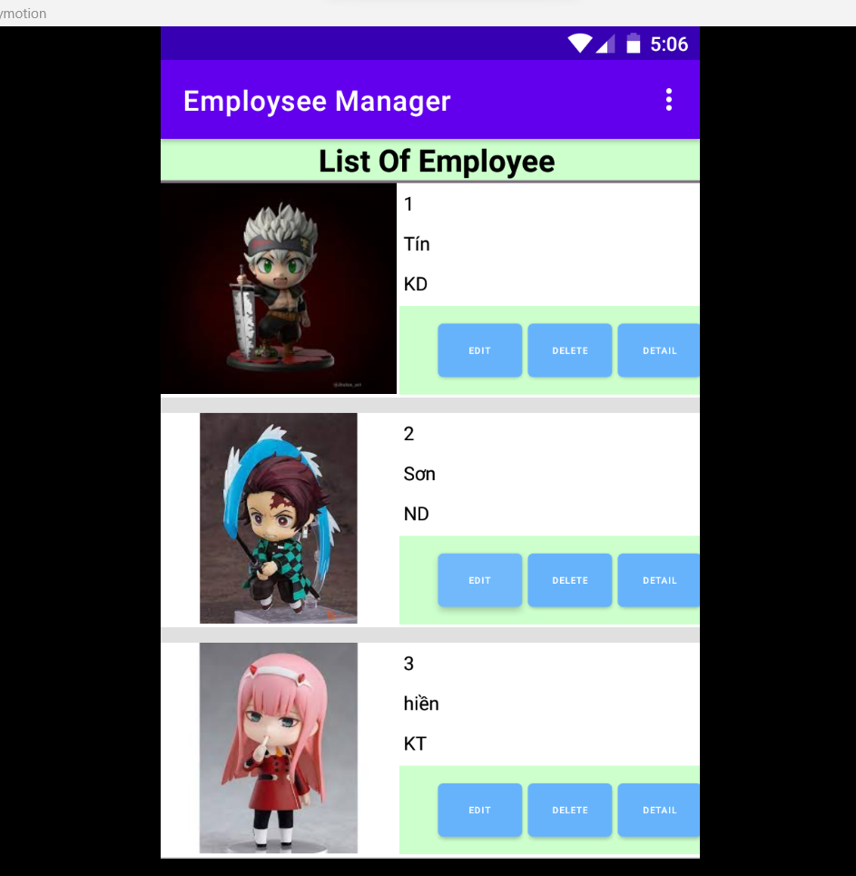
### Add Emloyment
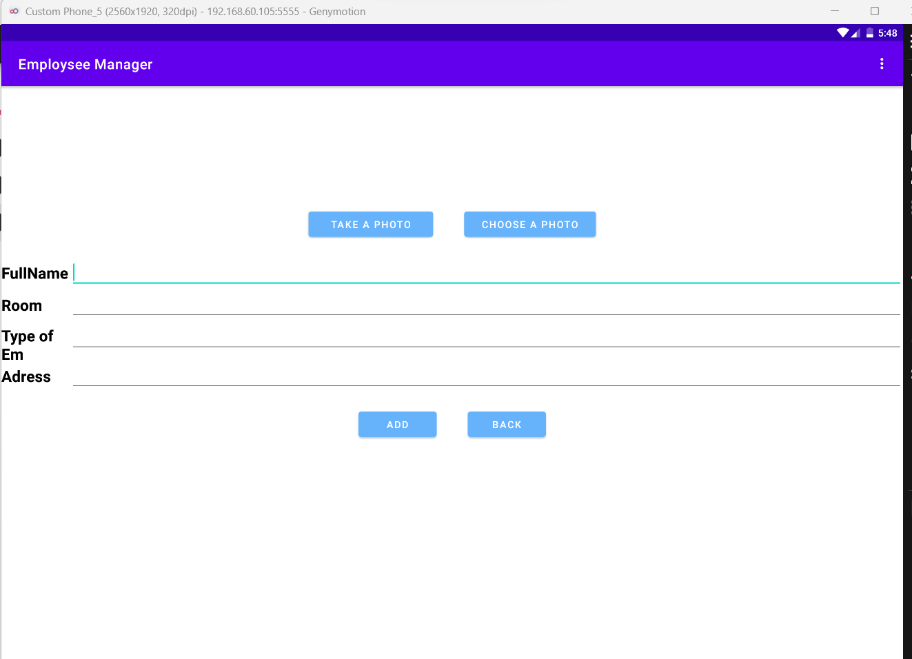
### update Eloyment
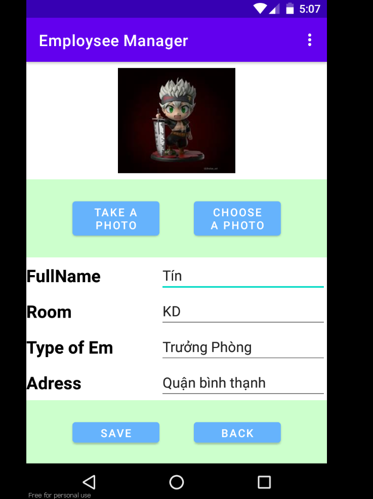
### roomm manager
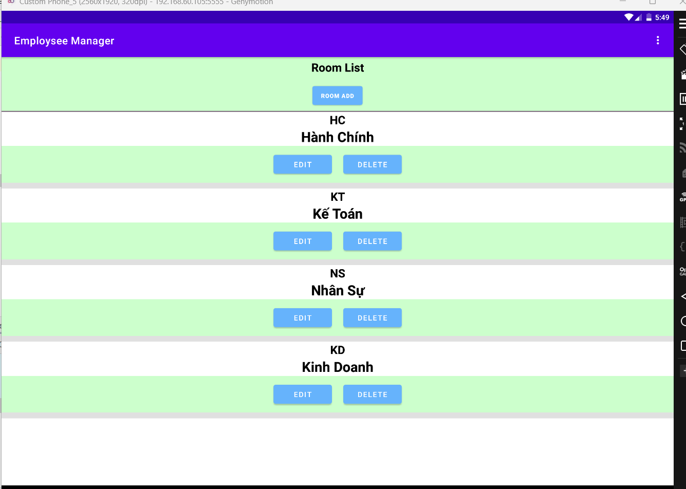
### roomm manager
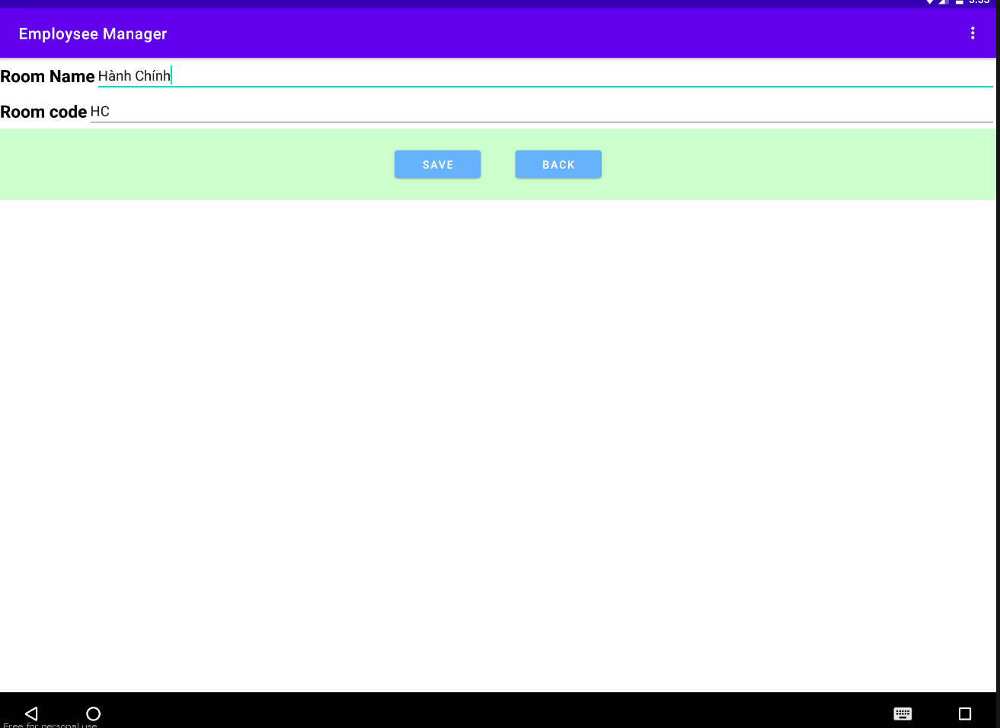
### Detail
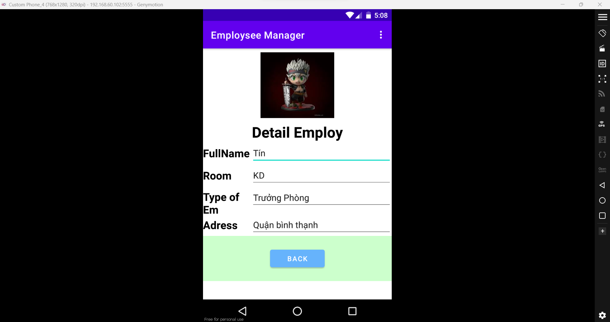
### About
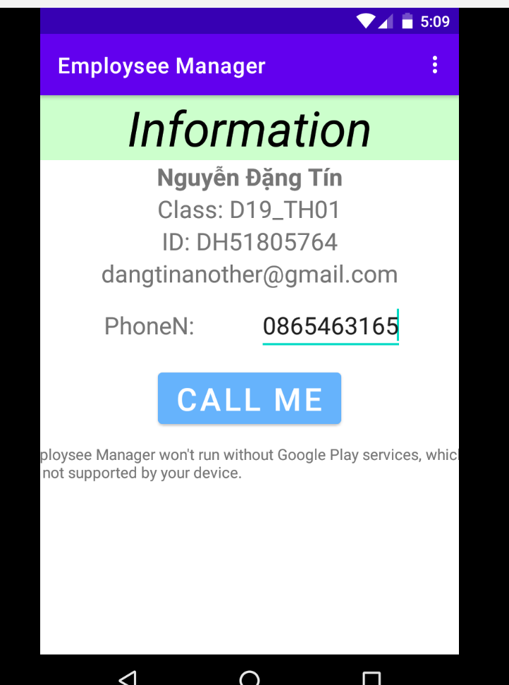
### Call
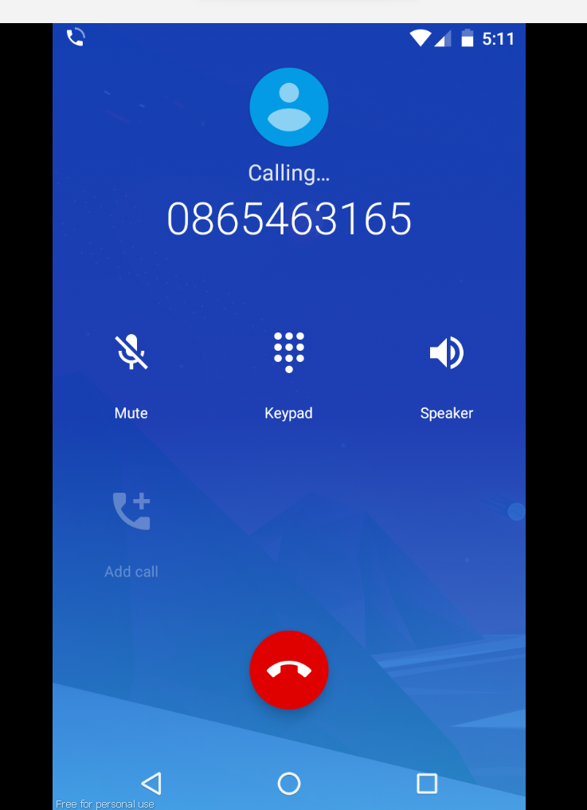
### Delete

### Login language vietnam
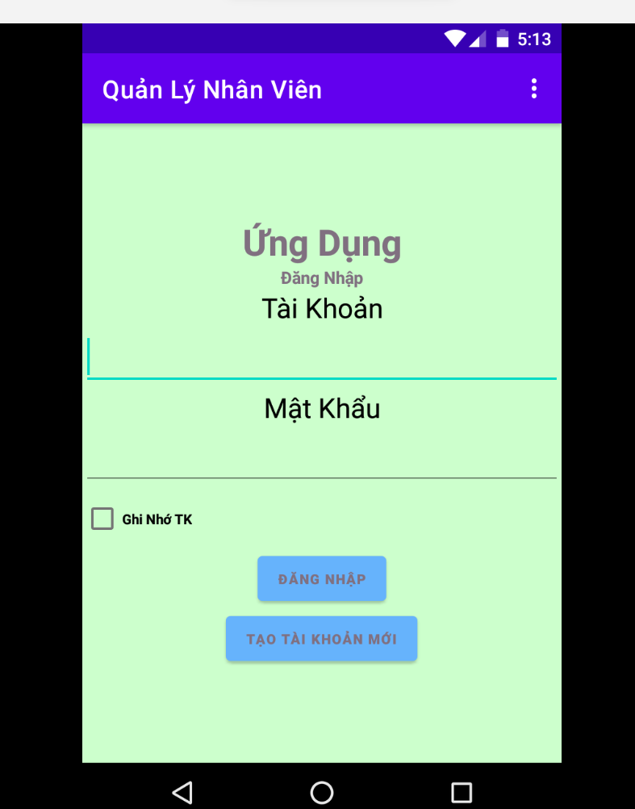
### Main page language vietnam
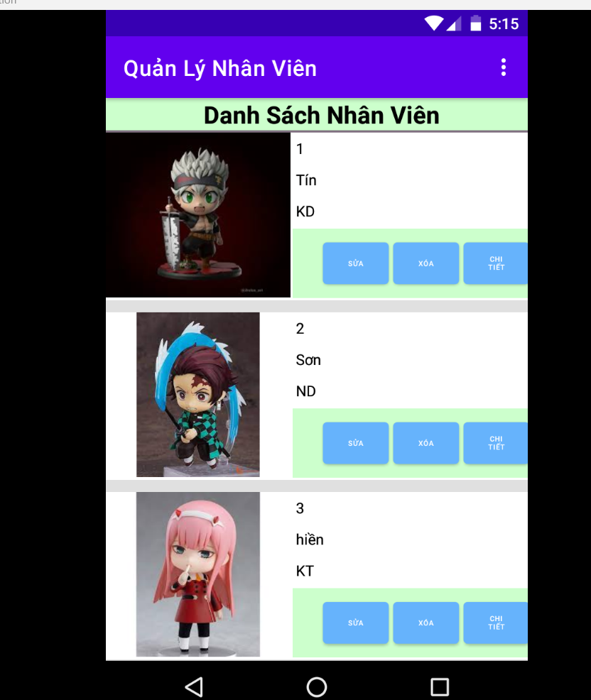
